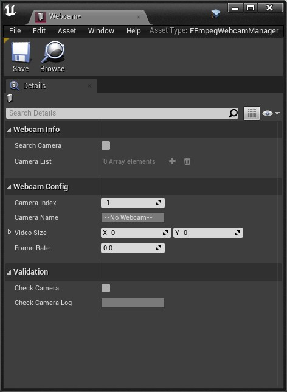

# FFmpegWebcamUnreal

Webcam Plugin based on FFmpeg for Unreal Engine

---
## 目录

- [支持环境](#支持环境)
- [安装步骤](#安装步骤)
- [操作说明](#操作说明)
- [蓝图节点介绍](#蓝图节点介绍)
- [文件目录](#文件目录)
- [使用到的模块及第三方库](#使用到的模块及第三方库)
- [作者](#作者)

---
### 支持环境

UE Version | Win64 | MacOS | Linux |
:---------:|:-----:|:-----:|:-----:|
  UE 4.27  |   √   |   √   |   x   |
  ......   |  ...  |  ...  |  ...  |

---
### 安装步骤
1. 克隆代码库至Plugin文件夹
2. 运行Setup脚本文件
3. 打开UE工程，编译插件并运行

---
### 操作说明
#### 创建FFmpegWebcamManager资产
1. 在Content Viewer中点击 右键 - Miscellaneous - Data Asset


2. 在弹出的窗口中选择并双击FFmpegWebcamManager


3. 为新建的资产重命名后即完成资产的创建

#### 配置资产

1. 搜索相机：点击Search Camera的方框进行相机的搜索，搜索结果将更新至Camera List中

2. 设置相机：通过更改Camera Index进行相机的选择，并设置Video Size和Frame Rate

3. 验证相机：设置完成后，可点击Check Camera的方框进行相机验证，验证结果将显示在Check Camera Log中，若验证失败，可以参照Log中的信息修改设置。

#### 构建蓝图

1. 在蓝图中创建新的变量，设置变量类型为FFmpegWebcamManager，并将配置好的资产赋予该变量

2. 根据所需完成蓝图构建，可参考Sample Map

---
### 蓝图节点介绍
1. Open Camera：打开相机
2. Read Frame：相机读取帧画面
3. Close Camera：关闭相机（可选）

4. Draw To Canva：配合Material Instance和Render Target可进行摄像头画面预览

5. Get Camera List：获取所有Camera名称列表

6. Image Buffer BGRA与Video Size：为后续操作提供画面数据

---
### 文件目录
```
FFmpegWebcamUnreal
├── FFmpegWebcamUnreal.uplugin
├── Content
│   └── ...
├── Resources
│   └── ...
├── Source
│   └── FFmpegWebcamUnreal
│       ├── FFmpegWebcamUnreal.Build.cs
│       ├── Private
│       │   ├── FFmpegWebcamManager.cpp
│       │   └── FFmpegWebcamUnreal.cpp
│       └── Public
│           ├── FFmpegWebcamManager.h
│           └── FFmpegWebcamUnreal.h
│
├── Setup.bat
├── Setup.command
│
├── README.md
├── doc
│   └── ...
└── utils
    └── ...

```
---
### 使用到的模块及第三方库
- [FFmpeg 4.4.1](https://ffmpeg.org/)
---
### 作者

chensihang@sensetime.com

sihangchen97@163.com
